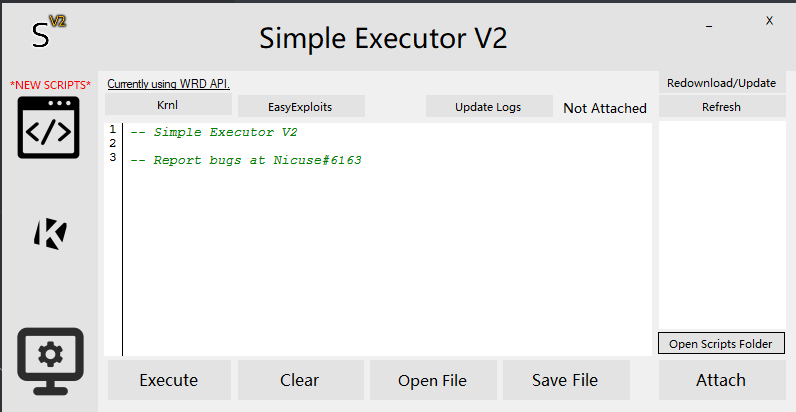

# Simple Executor V2 Download Guide

[Download Here (64-bit)](https://cdn.discordapp.com/attachments/929790736906461244/936583419444461578/SimpleExecutorV2.VERSION1.2.7.zip)
[Requirements](https://github.com/Nicuse/Simple-Executor-V2/blob/main/requirements.md)

Screenshot Of Executor:

By Installing or running the program, you automatically agree to our [terms of service](https://github.com/Nicuse/Simple-Executor-V2/blob/main/TermsOfService).

## Guide:
- Turn Off Your AntiVirus (no virus, it's just flagged as a virus)
- Download The Executor (of course dummy)
- Launch it.
- You're set.

## Execution Guide
- Get in a roblox game (must be website roblox)
- Launch Executor
- Attach DLL (WeAreDevs Or EasyExploits Or KRNL)
- Execute Script You Have (paste in the textbox or use a script from script hub)
- You're set, enjoy hacking!

FULL GUIDE: https://youtu.be/TsZg2-tTXMs
